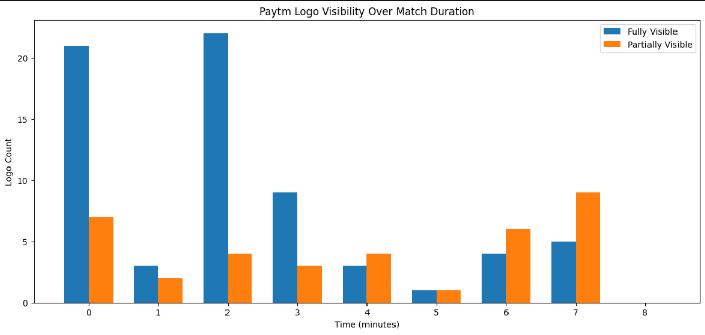
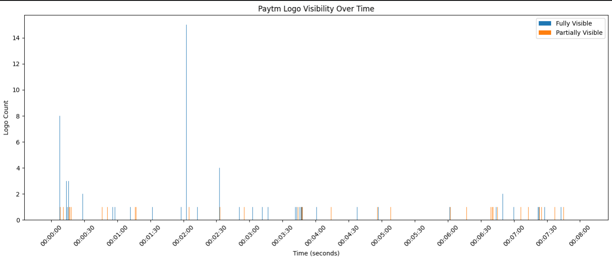
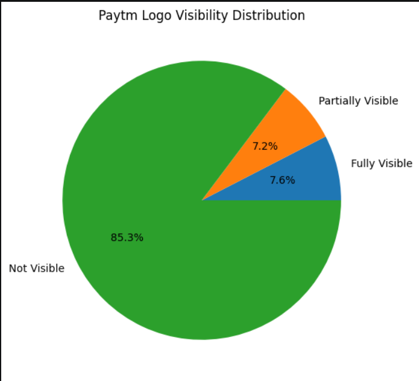
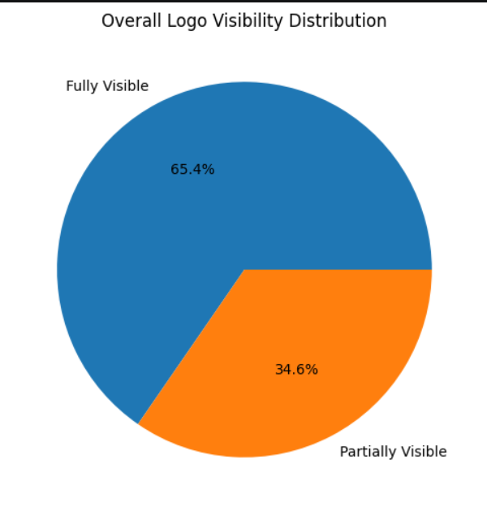

# 🏏 Paytm Logo Visibility Analytics using Computer Vision

> An end-to-end Computer Vision pipeline to detect, classify, and analyze the visibility of the Paytm logo in ICC cricket match broadcasts using YOLOv8, Optuna, and Streamlit.

---

## 📌 Overview

Cricket broadcasts involve dynamic camera angles, zoom transitions, player movements, and varying lighting conditions. As an official ICC advertising partner, Paytm requires a scalable and automated way to measure how effectively its stadium advertisements appear during live broadcasts and highlight reels.

This project delivers a **Machine Learning-powered Video Analytics System** capable of:

- Detecting the Paytm logo in cricket footage
- Classifying logo visibility
- Counting occurrences
- Generating time-stamped analytics reports
- Providing visual dashboards for stakeholders

The system helps quantify advertisement exposure and enables data-driven decisions for future sponsorship strategies.

---

# 🎯 Problem Statement

Manually reviewing hours of cricket footage to evaluate advertisement visibility is:

- Time-consuming
- Expensive
- Error-prone
- Non-scalable

This project automates the entire workflow using Computer Vision and Deep Learning techniques.

---

# 🚀 Key Features

## ✅ Logo Detection
Detects the Paytm logo frame-by-frame from video footage.

## ✅ Visibility Classification
Classifies logo appearance into:

| Visibility Type | Description |
|---|---|
| Fully Visible | Logo completely visible and unobstructed |
| Partially Visible | Logo partially cropped or obstructed |
| Not Visible | Logo absent from frame |

## ✅ Video Analytics
- Counts total appearances
- Tracks visibility duration
- Generates timestamped reports
- Supports highlight reel analysis

## ✅ Dashboard Visualization
Interactive analytics dashboard built with Streamlit.

---

# 🧠 Model Architecture

## 🔹 Detection Model
- **YOLOv8m (Ultralytics)**
- Optimized for high accuracy and real-time inference

## 🔹 Hyperparameter Optimization
- **Optuna**
- Automated tuning for:
  - Learning rate
  - Batch size
  - IoU threshold
  - Confidence threshold
  - Augmentation parameters

## 🔹 Frontend / Dashboard
- **Streamlit**
- Real-time visualization and analytics reporting

---

# 📊 Model Performance

| Metric | Score |
|---|---|
| Precision | 0.98 |
| Recall | 0.87 |
| mAP@50 | 0.94 |

The model demonstrates strong precision while maintaining robust recall across challenging broadcast conditions.

---

# 🏗️ System Architecture

```text
                    +----------------------+
                    |   User Uploads Video |
                    |   MP4 / AVI / MOV    |
                    +----------+-----------+
                               |
                               v
                    +----------------------+
                    | Temporary Video Save |
                    | temp_video.mp4       |
                    +----------+-----------+
                               |
                               v
                    +----------------------+
                    | Frame Extraction     |
                    | OpenCV VideoCapture  |
                    | 1 Frame / Second     |
                    +----------+-----------+
                               |
                               v
                    +----------------------+
                    | YOLOv8m Inference    |
                    | Paytm Logo Detection |
                    +----------+-----------+
                               |
                               v
              +----------------+----------------+
              |                                 |
              v                                 v
   +----------------------+        +------------------------+
   | Fully Visible Logo   |        | Partially Visible Logo |
   | Class ID: 0          |        | Class ID: 1            |
   +----------+-----------+        +-----------+------------+
              |                                |
              +----------------+---------------+
                               |
                               v
                    +----------------------+
                    | Timestamp Aggregator |
                    | HH:MM:SS level data  |
                    +----------+-----------+
                               |
                               v
                    +----------------------+
                    | Analytics Engine     |
                    | Counts, Duration,    |
                    | Exposure Score       |
                    +----------+-----------+
                               |
              +----------------+----------------+
              |                                 |
              v                                 v
   +----------------------+        +----------------------+
   | Streamlit Dashboard  |        | Report Generation    |
   | Metrics & Charts     |        | CSV + PDF Export     |
   +----------------------+        +----------------------+
```

# ⚙️ Challenges Addressed

## 🎥 Dynamic Camera Movements
Handled rapid camera transitions and zoom variations using robust detection training.

## 👥 Obstructions
Model trained on partially occluded logo samples to improve detection robustness.

## 🌗 Lighting Variations
Augmentation strategies applied for:
- Day/night matches
- Shadows
- Bright stadium lights

## 📦 Large Video Volumes
Efficient frame processing pipeline designed for:
- Long-duration HD videos
- Batch processing workflows
- Near real-time inference

---


# 🛠️ Installation

## Clone Repository

```bash
git clone https://github.com/your-username/paytm-logo-visibility-analytics.git

cd paytm-logo-visibility-analytics
```

## Install Dependencies

```bash
pip install -r requirements.txt
```

---

# 📊 Launch Streamlit Dashboard

```bash
streamlit run app.py
```

---

# 📈 Sample Output

## Logo Visibility Over Match Duration



---

## Logo Visibility Over Time



---

## Overall Logo Visibility Distribution



---

## Logo Visibility Distribution




---

# 💡 Future Enhancements

- Real-time live stream integration
- Multi-brand logo detection
- OCR-based sponsor board analysis
- Player-aware occlusion tracking
- Edge deployment optimization using TensorRT

---

# 🔬 Tech Stack

| Category | Technology |
|---|---|
| Deep Learning | YOLOv8m |
| Optimization | Optuna |
| Backend | Python |
| UI Dashboard | Streamlit |
| Video Processing | OpenCV |


---

# 📊 Business Impact

This solution enables:

- Quantifiable advertisement ROI measurement
- Sponsor visibility benchmarking
- Camera-angle effectiveness evaluation
- Strategic ad placement optimization
- Automated large-scale broadcast analytics

---

# 🧪 Example Use Cases

✅ ICC Tournament Analytics  
✅ Broadcast Sponsorship Evaluation  
✅ Stadium Advertisement Optimization  
✅ Sports Media Intelligence  
✅ Marketing ROI Analysis

---
